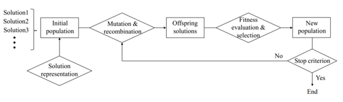

## [Evolutionary Optimisation Project]() 

This project explores the principles of evolutionary optimisation through the reconstruction of a target text sequence—referred to as the master sequence—using random generation and mutation-based evolution. The goal is to mutate a random text sequence through corruption until it is indistinguishable from the original and then take the corrupted text, and have this evolve over generations so that they converge toward athe original. This simulates how optimisation algorithms can refine solutions over time, inspired by biological evolution.

* Selected the master sequence from the first two lines of a Shakespeare sonnet based on student number.
* Generated N random sequences of the same length using letters of the alphabet.
* Selected the sequence with the smallest distance to the master sequence.
* Created N mutated copies of this sequence, with each letter having a probability p of changing.
* Chose the best offspring to continue evolving toward the master sequence.
* Repeated the process for G generations or until the target sequence was exactly matched.
* Visualised the increase in the distance to the master sequence during corruption and reduction in distance to the master sequence during optmisation across generations.
* Investigated how string length, probability and letters affect convergence.
* Discussed real-world applications 

